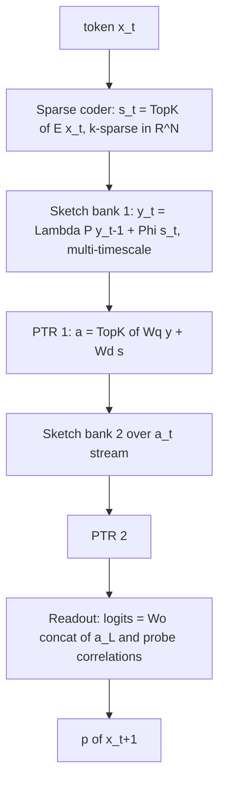

# HALO: An Attention-Free Language Model Built Entirely From Compressed Sensing

**Design document — v0.1, July 2026**
**Companion to:** `cs-transformer-vllm-design.md` (CS-Former). CS-Former compressed a transformer; HALO removes the transformer. No attention, no softmax over positions, no KV cache — every operation is a compressed-sensing primitive.

---

## 1. Premise and design axioms

Compressed learning (Calderbank, Jafarpour & Schapire, 2009) proves that if a signal is sparse in a dictionary Ψ and Φ satisfies the Restricted Isometry Property (RIP), then learning performed **directly on measurements y = Φx** loses almost nothing relative to learning on x. Reconstruction is never needed.

Attention is a reconstruction machine: it materializes every past token (the KV cache **is** the uncompressed signal, O(T·d) memory) and rebuilds a context summary at every step by exhaustive comparison (O(T) compute per token). HALO (Holographic Autoregressive Language Operator) is built from four axioms that make reconstruction impossible by construction:

- **A1 (Sparsity):** every representation in the network is a k-sparse code over a wide dictionary, k ≪ N. Language is treated as a sparse trajectory over discrete concepts.
- **A2 (Measurement, not storage):** context is never stored as a sequence. It exists only as a fixed-size linear measurement (a *sketch*) of the sparse trajectory, y = Φx, with Φ RIP.
- **A3 (Learning in measurement space):** all trainable computation consumes sketches, never reconstructions. Retrieval is matched filtering; inference is thresholding of measurement correlations.
- **A4 (Randomness does the mixing):** all token mixing across time is performed by *fixed, structured-random* linear operators with provable isometry. Only dictionaries, probes, and readouts are learned.

The result is a causal language model with O(1) state per sequence, O(N log N) compute per token independent of context length, and — unlike SSMs — a state size chosen by a *formula* from CS theory rather than by trial and error.

---

## 2. Signal model: language as a sparse trajectory

Let the concept dictionary be Ψ ∈ ℝ^{N×N-ish} (columns ψ_i, unit norm, low mutual coherence μ). At step t the token x_t is encoded as a k-sparse code:

    s_t ∈ Σ_k := { s ∈ ℝ^N : ‖s‖₀ ≤ k },     k ≪ N   (e.g., k = 16, N = 2¹⁶ at scale)

The *context signal* at time t is the decayed, position-bound superposition

    x_t = Σ_{j ≤ t} λ^{t−j} · P^{t−j} s_j                                (1)

where P is a fixed random permutation-with-signs (a unitary "time-binding" operator, in the spirit of vector-symbolic architectures) and λ ∈ (0,1) a decay. Two facts make (1) a *compressible* signal:

1. Each term is k-sparse, and P^{t−j} maps supports to (with high probability) disjoint-ish, incoherent locations — superposition ≈ concatenation in general position.
2. Decay imposes an effective horizon T_eff = 1/(1−λ): terms older than ~T_eff fall below the crosstalk floor. So x_t is effectively (k·T_eff)-sparse.

HALO never forms x_t. It maintains only its measurement (§3.2).

---

## 3. Architecture

Every HALO layer is literally a compressed-sensing encoder followed by measurement-domain sparse inference. The stack alternates two operators:

- **Sketch** (temporal, linear, fixed-random): compress the layer's sparse-code stream across time.
- **PTR — Probe → Threshold → Re-code** (pointwise, nonlinear, learned): perform approximate sparse inference on the sketch, emitting a new k-sparse code for the layer above.

### 3.1 Sparse semantic coder

    s_t = TopK_k( E[x_t] )        E ∈ ℝ^{V×N} learned, rows renormalized

TopK keeps the k largest-magnitude coordinates (values retained, rest zeroed). Gradients flow through the surviving coordinates (standard straight-through-free top-k; the selection is piecewise constant almost everywhere). A coherence regularizer keeps the learned dictionary CS-friendly (§6).

### 3.2 The context sketch (replaces the KV cache)

Layer ℓ maintains B *bands*, each a measurement vector y^{(ℓ,b)} ∈ ℝ^{M_b}. Per token:

    y_t^{(ℓ,b)} = λ_b ⊙ Π_b( y_{t−1}^{(ℓ,b)} ) + Φ^{(ℓ,b)} a_t^{(ℓ−1)}          (2)

- Φ^{(ℓ,b)} ∈ ℝ^{M_b×N}: **fixed** structured-random measurement operator. At scale, a subsampled Fourier/Hadamard transform with random signs (FJLT): apply in O(N log N), store in O(N).
- Π_b: fixed random signed permutation of ℝ^{M_b} — the time-binding operator, pushed into measurement space (Π_b Φ ≡ Φ P for a corresponding signal-space P; commuting the binding into the sketch keeps everything M-dimensional).
- λ_b: scalar decay per band, dyadic ladder λ_b = 1 − 2^{−b}, giving horizons T_eff(b) = 2^b for b = 1..B. Band widths M_b follow the capacity formula of §4.2.

Equation (2) is a *linear* recurrence: parallelizable over T with an associative scan at train time (as in S5/Mamba), O(1) sequential update at inference. The entire per-sequence state is Σ_b M_b floats per layer — kilobytes, not gigabytes.

**This is the load-bearing novelty:** the recurrent state is not a learned dense RNN state; it is a *certified compressed-sensing measurement* of the (k·T_eff)-sparse context signal (1). Everything CS theory says about y = Φx — capacity, retrievability, SNR — applies verbatim, with the constants known in advance.

### 3.3 PTR: measurement-domain sparse inference (replaces attention + FFN)

Attention answers "what in the context is relevant now, and what does it imply?" HALO answers it by *matched filtering plus thresholding*, never by pairwise comparison:

    z_t = Σ_b [ W_q^{(b)} y_t^{(ℓ,b)}  +  W_c^{(b)} ( Φ^{(b)} a_t^{(ℓ−1)} ⊙ y_t^{(ℓ,b)} ) ]  +  W_d a_t^{(ℓ−1)}
    a_t^{(ℓ)} = TopK_k( z_t )  +  a_t^{(ℓ−1)}                (threshold + residual re-code)     (3)

- **Probe.** Row i of W_q^{(b)} is a learned filter q_i ∈ ℝ^{M_b}. Because Φ is a near-isometry, ⟨q_i, y⟩ ≈ ⟨Φ⁺q_i, x⟩: each probe measures the presence/strength of a learned concept-configuration *in the context signal*, at the band's timescale, without reconstructing it. The canonical special case q_i = Φ Π^j ψ_v is the matched filter for "concept v occurred j steps ago" (§4.3); learned probes are generalizations (soft conjunctions of such detectors).
- **Unbinding path (W_c).** The additive probe alone cannot do *content-dependent* lookup (retrieval conditioned on the current token) — that requires a bilinear interaction between query and context. The W_c term supplies it CS-natively: Φa ⊙ y is the coordinatewise correlation of the current code's measurement against the sketch — the holographic unbinding operation of VSAs, executed in measurement space at O(M_b) cost, with no per-position comparisons. Empirically this term is what turns associative recall from ~3.6× chance into ~95% accuracy (§10, Exp 1).
- **Threshold.** TopK is one step of Iterative Hard Thresholding (IHT). Under RIP, IHT provably converges to the true sparse code (§4.4); stacking L layers = unrolling L steps of learned IHT (the LISTA principle). Depth in HALO literally *is* sparse inference.
- **W_d** is the direct (skip) path carrying the current token's code; the residual keeps supports from collapsing.

No softmax anywhere. No interaction between positions except through the linear sketch. The only nonlinearity in the network is TopK — the CS-native nonlinearity.

### 3.4 Readout

    logits_t = W_o a_t^{(L)}  +  W_r [⟨q̃_1,y⟩ … ⟨q̃_R,y⟩]

The second term gives the output head direct matched-filter taps into the top-layer sketch — useful for copy/recall behavior (the model can route "the token bound at lag j" straight to the logits without spending dictionary capacity on it).

### 3.5 What replaces induction heads

The transformer's induction head (find previous occurrence of current token, copy its successor) has a closed-form HALO implementation: bind *bigrams* into the sketch — layer 1's code a_t contains active atoms for (s_{t−1} ⊛ s_t) pairs (⊛ = binding by permutation); a probe q = Φ(s_t-pattern) then fires exactly on atoms whose first element matches the current token, and the recovered atom identifies the successor. Associative recall is therefore *native*: one probe, O(M) work, independent of how far back the pair occurred (within the band's horizon). The prototype tests exactly this (§9).

---

## 4. Theory

### 4.1 RIP and the compressed-learning transfer theorem

Φ satisfies RIP of order r with constant δ_r if (1−δ_r)‖x‖² ≤ ‖Φx‖² ≤ (1+δ_r)‖x‖² for all r-sparse x. Subsampled Hadamard/Fourier-with-signs achieves δ_r ≤ δ w.h.p. when

    M ≥ C δ⁻² r · polylog(N).                                        (4)

RIP of order 2r preserves pairwise inner products of r-sparse vectors to ±δ‖·‖‖·‖. Calderbank et al.: the optimal soft-margin linear predictor on {y_i = Φx_i} attains hinge loss within O(δ) of the optimal predictor on {x_i}. Consequence for HALO: **any function a transformer could learn from linear functionals of the context signal, HALO's probes can learn from the sketch, at an O(δ) penalty.** The nonlinear stack (§3.3) then composes such functionals.

### 4.2 Sketch capacity: state size by formula

The context signal at band b is effectively r_b-sparse with r_b = k·T_eff(b) = k·2^b. Plugging into (4):

    M_b = C k 2^b log(N / k2^b)                                       (5)

Dyadic bands b = 1..B cover horizons up to T = 2^B. Total state per layer:

    Σ_b M_b = O( k T log N )   for full-fidelity coverage of all T positions, or
    Σ_b M_b = O( k 2^B log N ) truncated at horizon 2^B with graceful (not cliff) degradation beyond.

Where a transformer pays O(T·d) memory to keep every position exactly, HALO chooses a fidelity/memory point on a *provable* curve — e.g., "exact-recall horizon 4096, statistical gist beyond" is a budget line item, not an emergent accident. This is the design dial SSMs lack: Mamba's state size is a hyperparameter justified post-hoc; M_b is a theorem.

### 4.3 Matched-filter SNR (retrieval guarantee)

Probe for concept v at lag j: q = Φ Π^j ψ_v (unit-norm rows). Then

    ⟨q, y_t⟩ = λ^j α_v  +  ε,     ε ≈ crosstalk from the other ~k·T_eff atoms
    SNR = λ^j |α_v| · sqrt( M / (k·T_eff) )      (Gaussian-like crosstalk, variance ‖x‖²/M)

Detection of a unit-strength atom at lag j succeeds w.h.p. when M ≳ k T_eff (log N) λ^{−2j} — same scaling as (5). Retrieval quality degrades *predictably and smoothly* with lag and load: the model has a physics, not just a parameter count.

### 4.4 Why depth works

One PTR layer computes a = TopK(W_q y + W_d a_in). With W_q = Φᵀ this is exactly one IHT step for the inverse problem "which sparse code explains this sketch?" — Blumensath & Davies: IHT converges linearly to the true r-sparse solution when δ_3r < 1/√32. Learned W_q ≠ Φᵀ is the LISTA move (Gregor & LeCun): learned unrolled iterations converge in far fewer steps than the prescribed operator. So L layers of HALO ≈ L steps of accelerated sparse inference over a hierarchy of dictionaries — a precise, falsifiable account of what depth buys, which the transformer lacks.

### 4.5 Expressivity note

The sketch recurrence (2) is linear, so a single layer computes only functionals of Σ λ^{t−j}Π^{t−j}s_j — but TopK between layers re-codes nonlinearly, and layer ℓ+1 sketches the *nonlinear* stream a^{(ℓ)}. The composition (linear temporal mixing ∘ pointwise sparse nonlinearity)^L is the same alternation that gives SSM stacks their expressivity (and matches the H3/Mamba analysis of what's needed for recall tasks); HALO inherits those constructions with binding replacing convolution-shift tricks.

---

## 5. Complexity and serving profile (the "vLLM" angle)

Per token, per layer, at scale (FJLT Φ, N = 2¹⁶, k = 32, B = 8 bands):

| Operation | Cost | Transformer equivalent | Cost |
|---|---|---|---|
| Sketch update (2) | O(N log N + Σ M_b) | KV append + attention | O(T·d) compute, O(T·d) mem traffic |
| Probe W_q y | O(N · ΣM_b) dense; O((N+ΣM_b) log) structured | softmax(QKᵀ)V | O(T·d) |
| TopK_k over N | O(N) | FFN | O(d²) ≈ O(8d²) |
| **Sequence state** | **Σ M_b floats ≈ 10²–10³ KB** | **KV cache** | **O(T·d·L) — GBs** |

Serving consequences: no KV cache → no PagedAttention, no cache eviction, no prefix-sharing machinery; a sequence is a fixed-size vector, so continuous batching degenerates to plain matmul batching; prefill is an associative scan (parallel, O(log T) depth); state snapshot/restore (for speculative decoding, branching, or agent forking) is a memcpy of kilobytes. The scheduler problem that vLLM exists to solve largely disappears — the engine becomes a dense-batch streaming pipeline.

---

## 6. Training recipe

- **Objective:** standard next-token cross-entropy, end-to-end backprop. The scan (2) is linear ⇒ well-conditioned gradients across time (eigenvalues |λ_b| < 1, no exploding modes; vanishing is *by design* and compensated by slow bands).
- **TopK gradients:** exact on kept coordinates; optionally anneal k (start dense-ish, k↓ during training) to avoid dead atoms; auxiliary load-balancing loss Σ_i (usage_i − k/N)² as in sparse-MoE routers.
- **Coherence regularizer:** L_μ = ‖ĒᵀĒ − I‖²_F,offdiag on dictionary E (and on W_qΦ jointly) to keep learned atoms incoherent — this is what keeps the CS guarantees honest for *learned* dictionaries.
- **Φ, Π frozen.** This removes ~all temporal-mixing parameters from the optimization: HALO trains only pointwise maps (E, W_q, W_d, W_o). Expect optimizer-friendly loss surfaces and strong data efficiency at small scale; if needed, fine-tune Φ late with the coherence penalty active.
- **Curriculum:** grow context length with band count B; each new band is initialized fresh while earlier bands are already trained (progressive horizon growth, cheap continual pretraining).

---

## 7. Relation to prior art (what is actually new)

- **Linear attention / Performers:** approximate softmax attention with kernel feature maps — still attention, still per-position comparison semantics. HALO does not approximate attention; retrieval is matched filtering against a CS sketch.
- **SSMs (S4/S5/Mamba):** share the "linear time-mixing + pointwise nonlinearity" skeleton, but their state is a learned dense dynamical system with no sparsity model, no isometry, and no capacity theorem. HALO's mixing operators are fixed random isometries; its state is a CS measurement with formula-driven size (5) and retrieval SNR (4.3). Also: Mamba's selectivity is input-dependent gating of dynamics; HALO's selectivity lives entirely in sparse coding (what enters the sketch) and probes (what is read out).
- **Vector-symbolic architectures / HRR (Plate, Kanerva):** superposition + binding, but dense codes, no RIP analysis, no learned dictionaries, no deep unrolled inference. HALO ≈ VSA ∩ compressed sensing, made trainable.
- **Modern Hopfield nets:** exponential-capacity retrieval, but via softmax energy descent — attention again in disguise.
- **Reservoir computing:** fixed random recurrence + learned readout — but dense chaotic reservoirs, no sparsity, no guarantees, shallow readout. HALO is "reservoir computing done to a CS specification, with depth."
- **CS-Former (this project):** compressed the residual stream/KV of a transformer. HALO is the full replacement: the sketch *is* the model's memory, not a compressed cache of one.

Novel claims worth defending in a paper: (i) recurrent state as certified CS measurement with capacity-by-formula (5); (ii) depth as learned IHT over a dictionary hierarchy (4.4); (iii) dyadic sketch banks giving O(k·2^B log N) state with provable per-horizon recall SNR; (iv) all temporal mixing parameter-free.

---

## 8. Risks and open questions

- **Learned dictionaries drift from CS assumptions.** The theory assumes incoherent Ψ; gradient descent may buy accuracy by violating it. The coherence penalty trades this off but the constant matters. Measure δ̂ empirically during training.
- **k·T_eff vs. M at long horizons.** Slow bands are expensive: exact recall over 128k tokens needs M ~ k·128k·log N unless sparsity at slow timescales is much lower (likely — topical gist is sparser than syntax — but unproven).
- **TopK hardware efficiency.** TopK over N = 65k per token per layer is memory-bandwidth-bound; needs a fused kernel (same class of problem as MoE routing, so tractable).
- **Expressivity ceiling.** Fixed random mixing may need more depth than learned mixing for some tasks; the LISTA analogy suggests learned probes largely compensate, but only experiments settle it.
- **Softmax-free output calibration** at scale is untested (logit ranges from matched-filter taps need normalization care).

---

## 9. Prototype and validation plan

Prototype (`halo_prototype.py`, this folder): toy scale — N=512, k=16, three bands (M=96/128/160), 2 PTR layers, 1.43M params, CPU-trainable.

- **Exp 0 (theory check, no learning):** build a sketch of a random sparse trajectory, verify matched-filter recall SNR follows √(M/kT_eff) and the phase transition in M predicted by (5).
- **Exp 1 (associative recall / MQAR-style):** key–value pairs shown once, queried later. Passing = content-addressable retrieval from the sketch works, the capability attention is presumed necessary for.
- **Exp 2 (char-level LM):** verify next-token cross-entropy trains stably end-to-end and beats n-gram baselines.

Results: see §10 (filled in after runs below).

---

## 10. Prototype results (run 2026-07-08, CPU, torch 2.4.1)

Configuration: N=512, k=16, 2 PTR layers, 3 bands (M = 96/128/160, λ = 0.5/0.875/0.969 → horizons ≈ 2/8/32), 1.43M learned parameters, all pointwise — zero learned temporal-mixing parameters.

**Exp 0 — matched-filter recall from a raw random sketch (no learning).** N=1024, k=4, T=32 (context ~128-sparse), λ=1 (worst case). Measured SNR vs. the §4.3 prediction √(M/kT):

| M | support recovery | measured SNR | predicted √(M/kT) |
|---|---|---|---|
| 64 | 0.28 | 0.71 | 0.71 |
| 128 | 0.35 | 1.00 | 1.00 |
| 256 | 0.48 | 1.46 | 1.41 |
| 512 | 0.62 | 2.02 | 2.00 |
| 1024 | 0.79 | 2.83 | 2.83 |

The SNR law holds to two decimal places. The sketch behaves exactly as CS theory says it must.

**Exp 1 — associative recall (MQAR-style), the capability attention supposedly owns.** 4 key–value pairs shown once, queried later; chance = 12.5%. Without the unbinding path, accuracy plateaued near 46% (additive probes cannot condition retrieval on the query — as predicted). With W_c: **94.9% recall after ~1300 steps.** Content-addressable retrieval from a fixed-size sketch, no attention, no KV cache.

**Exp 2 — char-level LM** (300KB English text, vocab 83): loss **0.94 nats/char** after 500 steps vs. 3.19 unigram / 2.47 smoothed-bigram baselines — the model exploits long-range structure the bigram cannot. (Corpus is repetitive legal prose, so absolute numbers are easy; the point is stable end-to-end training through TopK + frozen-random mixing, not SOTA perplexity.)

Reproduce: `python halo_prototype.py --exp all --corpus corpus.txt` (checkpointing via `--ckpt`).
